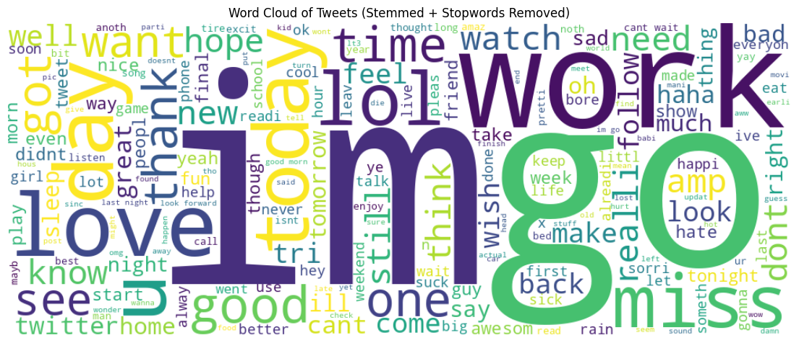
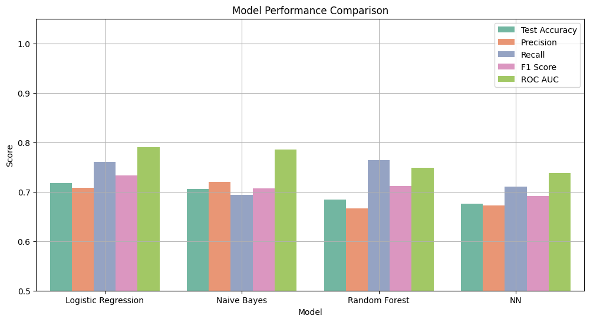
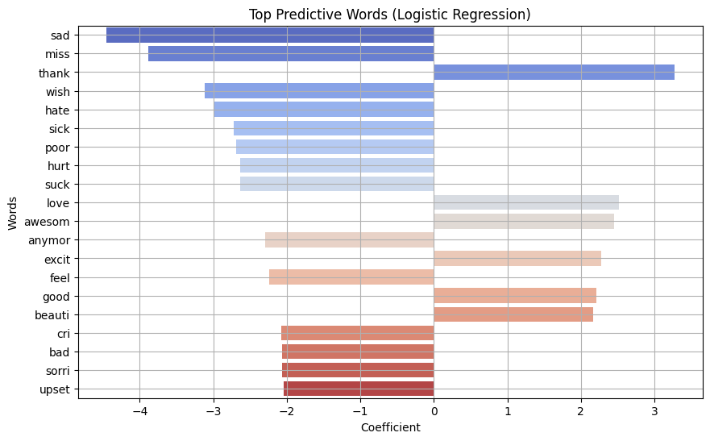

# 🐦 Twitter Sentiment Analysis (NLP Project)

This project performs **sentiment analysis** on Twitter text data using **Natural Language Processing (NLP)** and **Machine Learning**.  
The goal is to classify tweets into **Positive**, **Negative**, or **Neutral** sentiment after cleaning and preprocessing the text.

---

## 📌 Project Workflow

The notebook includes the full end-to-end pipeline:

### **1️⃣ Environment & API Setup**
- Python environment configuration  
- Twitter API / dataset configuration  

### **2️⃣ Import Libraries**
Core libraries used:
- NumPy  
- Pandas  
- Matplotlib / Seaborn  
- NLTK  
- Scikit-learn  

### **3️⃣ Data Loading**
- Loading the Twitter dataset into a Pandas DataFrame  
- Checking structure, shape, and sample entries  

### **4️⃣ Data Cleaning & Preprocessing**
Steps include:
- Removing URLs  
- Removing punctuation and special characters  
- Lowercasing  
- Stopword removal  
- Tokenization  
- Lemmatization  

### **5️⃣ Feature Engineering**
- Converting text to numerical vectors  
- TF-IDF vectorization  

### **6️⃣ Model Training**
Models tested:
- Logistic Regression  
- Naive Bayes  
- Random Forest  
- Neural Network

### **7️⃣ Model Evaluation**
Metrics generated:
- Accuracy  
- Precision  
- Recall  
- F1-Score  
- ROC AUC  

### **8️⃣ Final Results & Insights**
The notebook includes:
- Visualizations  
- Most impactful words  
- Comparison of model performance





---

## 📂 Repository Structure

```
Twitter-Sentiment-Analysis/
├── README.md
├── Twitter_Sentiment_Analysis.ipynb   
└── results/
    ├── wordcloud.png
    ├── model_performance.png
    └── top_words.png

```
## 👤 **Author**

**Akant Bhola**  
Data Analyst  
📧 **Email:** akantbhola.AB@gmail.com  
🔗 **LinkedIn:** https://www.linkedin.com/in/akant-bhola/  

---

